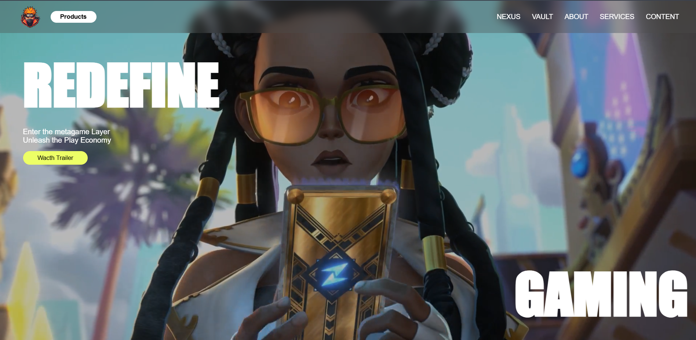

# Frontend Project - Animated website

A sleek, responsive landing page featuring a full-screen hero video, animated gradient text, and interactive UI elements built with HTML and CSS.

---

## Demo

> Add your live demo link here  
> https://kartik-hub-enjay.github.io/frontend-animated-website1/

---

## Features

- Fullscreen hero section with background video  
- Animated gradient text effects using CSS keyframes  
- Responsive design optimized for desktop and mobile  
- Custom clip-path shapes for decorative elements  
- Smooth scroll behavior  
- Interactive buttons with hover effects  
- Modern glassmorphism-inspired header and footer  
- Flexible grid layout for content cards  

---

## Screenshots

